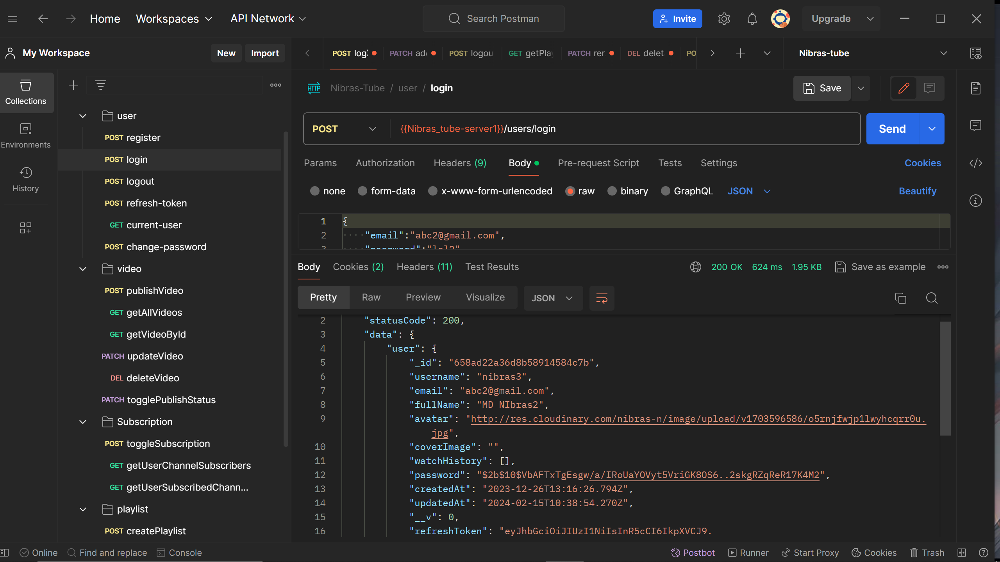
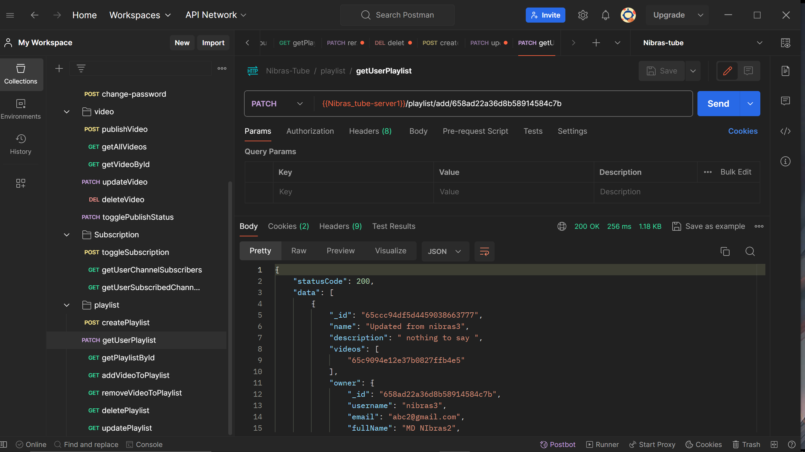

# A complex backend YOUTUBE clone project with Node , express , mondgodb , mongoose 

- ### Learning From this project:

    - File Structure Organization

    - Clean Code Principles
    - Backend Development with Node.js and Express
    - Database Integration with MongoDB and Mongoose
    - Data manipulation using MONGODB Aggregation Pipeline
    - API Design and Development
    - Error Handling and Debugging
    - Testing and Quality Assurance
    - Authentication with JWT
    - User Management
    - Token-Based Authorization
    - Middleware Integration
    - Token Expiration and Refresh
    

- #### [Model Link](https://app.eraser.io/workspace/Hn8XdIqulrDBKUoxh4uX?origin=share)

- Model overview :

    - 
- Postman SS:
    - 
    - 
- Atlas SS:
    - 